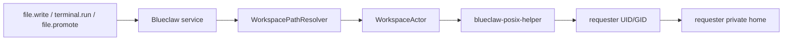
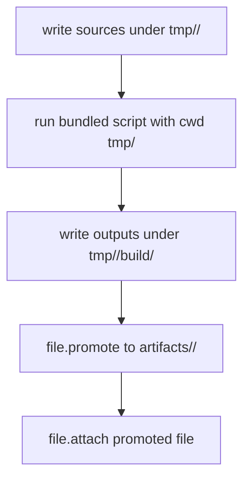

# Blueclaw

Blueclaw is the daemon that runs inside `InternKim`, a dedicated hardware appliance for company AI automation.

## Current Working Model

- `InternKim` is a separate computer that the customer owns
- `InternKim` is a headless device with no attached display
- `Blueclaw` runs on `InternKim` as a long-lived daemon
- `InternKim` is reachable remotely through `Cloudflare Tunnel`
- remote admin access is expected to sit behind `Cloudflare Tunnel` with `Google OAuth`
- `InternKim` connector sidecars own Mattermost, Slack, and Signal platform credentials
- `Blueclaw` receives normalized connector events from `InternKim` and never stores platform tokens
- `Mattermost` is self-hosted inside `InternKim`
- `Mattermost` is the primary collaboration surface for users, tasks, replies, progress, and approvals
- `Mattermost` is an `InternKim`-native internal service, separate from the isolated `Blueclaw` guest
- `Mattermost` realtime WebSocket ingress runs outside Blueclaw behind the capability boundary
- Slack and Signal are optional external connectors that share the same connector runtime without becoming the product center
- `Blueclaw` stores policy, memory, task state, backups, and artifacts on persistent workspace storage
- `Blueclaw` supports one-time, interval, and cron-based scheduled task execution
- `Blueclaw` may ask the user's main computer to open a browser instance when a flow requires direct user login or approval
- `Blueclaw` is configured and operated from the user's main computer through `SSH` and `HTTP API`
- the primary deployment model is `Blueclaw inside a long-lived Firecracker guest with only workspace mounted from the host`
- the primary development lab uses `macOS host -> Apple container Ubuntu VM -> Firecracker -> Blueclaw`

## Architecture Picture

```text
  Mattermost users / admin channel
          ^
          |
          v
  +-----------------------------------+
  | InternKim hardware                |
  |                                   |
  |  Cloudflare Tunnel                |
  |  headless host OS                 |
  |    - tiny supervisor              |
  |    - capability sidecars          |
  |    - workspace volume             |
  |    - self-hosted Mattermost       |
  |                                   |
  |  isolated guest                   |
  |    - blueclaw daemon              |
  |    - postgres                     |
  |    - admin API                    |
  |    - task inbox API               |
  |    - policy engine                |
  |    - memory engine                |
  +-----------------------------------+
          ^                     ^
          |                     |
          |                     |
          v                     v
  +-----------------------------------+
  | user's main computer              |
  |    - SSH client                   |
  |    - admin/task UI client         |
  |    - companion bridge             |
  |    - browser instance             |
  |    - user approval surface        |
  +-----------------------------------+

Optional external channels such as Slack and Signal terminate in InternKim sidecars and enter Blueclaw only as normalized connector events.
```

## Main Computer Bridge

- `InternKim` and the user's main computer need a trusted communication channel
- the main computer runs a small companion bridge
- the bridge can launch a browser window or tab on the main computer
- login-required flows stay user-mediated instead of trying to bypass authentication
- `Blueclaw` can pause a task, ask for login or approval, and resume after the bridge reports completion
- scheduled automation should create new task runs instead of bypassing the task engine

## Control Plane

- `InternKim` has no local screen, so configuration happens from the user's main computer
- the primary control paths are `SSH`, `HTTP API`, and browser-based surfaces rendered on the main computer
- `Blueclaw` admin and task surfaces should be reachable through `SSH` port forwarding, authenticated API access, or a tightly scoped remote tunnel path
- the tunnel-protected admin surface should only admit the initial bootstrap administrator account or a `master admin` account
- `Google OAuth` is the outer remote access gate, and Blueclaw role checks are the inner authorization gate
- the physical appliance is the system of record, while the main computer is the operator console

## Messaging Plane

- `InternKim` owns Mattermost WebSocket ingress, Mattermost API calls, optional Slack Events API or Socket Mode, optional Signal sessions, platform tokens, and platform API calls
- `Blueclaw` exposes `/connectors/{platform}/events` as a normalized internal ingress endpoint for `InternKim` sidecars
- `Mattermost` events are the primary production connector path and enter Blueclaw through `ConnectorRuntime`
- `Slack` and `Signal` events use the same connector runtime as optional adapters
- Blueclaw keeps idempotency, invited-email authorization, task creation, progress orchestration, LLM reply decisions, and structured logs
- `Mattermost` is self-hosted inside `InternKim`
- `Mattermost` is an internal service separate from the isolated `Blueclaw` guest
- `InternKim` capability endpoints perform identity lookup, optional progress publication, reply send, and history fetch
- Mattermost typing/progress, Slack typing, and similar platform affordances are represented as optional InternKim progress, not as Blueclaw platform API calls
- InternKim sidecars suppress bot/self messages before forwarding events
- duplicate suppression, invited-email authorization, task creation, LLM reply generation, fallback replies, and structured logs remain shared by the connector core
- the messaging plane and the control plane should stay separated

## Connector Configuration

Runtime connector configuration is secretless. Blueclaw does not read Mattermost, Slack, or Signal tokens. Mattermost is enabled by default in InternKim deployments; Slack and Signal are optional adapters.

```json
{
  "capabilities": {
    "transport": "vsock",
    "endpoint": "http://internkim-capability",
    "unixSocketPath": "",
    "vsockCID": 2,
    "vsockPort": 7000,
    "timeoutSecond": 15
  },
  "connectors": {
    "mattermost": {}
  }
}
```

- the product runtime config reaches the InternKim capability layer over `vsock` from inside the Firecracker guest; a Unix-socket transport is only used in non-guest/dev layouts
- Slack and Signal are capabilityd sidecars activated by the presence of their credential/config files (Slack token, Signal JSON-RPC config) on the host, not by an `enabled` flag in Blueclaw runtime config
- `/connectors/mattermost/events` accepts the primary normalized event stream from the self-hosted Mattermost sidecar
- `/connectors/slack/events` and `/connectors/signal/events` accept optional external normalized events when those adapters are configured
- platform request signatures, bot tokens, WebSocket credentials, Signal session secrets, and platform reply credentials stay in InternKim sidecars
- Blueclaw capability adapters call `POST /v1/platform/{platform}/identity.resolve`, `reply.send`, and `history.fetch`; `progress.start` and `progress.stop` are optional
- inbound bodies use opaque `conversationID`, `messageID`, `senderID`, `replyTargetID`, `prompt`, and recent `context.messages`
- connector logs use `connector.<platform>.<stage>` event names
- persistent logs default to `/workspace/.blueclaw/logs` and are retained for 7 days unless configured otherwise

Connector delivery is durable, not fire-and-forget. Inbound events are persisted in `raw_event` with a `pending`/`running`/`succeeded`/`failed` connector status; replies are enqueued into `connector_outbox` referencing the originating `raw_event`. Synthetic resume sources (auto-resume after a runtime restart, ask-choice resolution, steer) also ensure a backing `raw_event` row so the outbox foreign key holds. Background workers claim stale rows with retry/backoff, duplicate inbound events return the stored connector result instead of re-running, and the health check fails on missing connector schema or excessive backlog.

## Workspace, Tools, and Actor Boundary

Blueclaw separates orchestration identity from workspace side-effect identity.

- The Blueclaw daemon runs as the guest `blueclaw` user.
- The daemon resolves virtual paths, checks policy, validates tool schemas, records events, and asks the LLM for recovery or user-facing wording.
- Requester-visible filesystem and process side effects run through `WorkspaceActorFactory -> WorkspaceActor`.
- The production actor uses `blueclaw-posix-helper`, not direct `os.ReadFile`, `os.WriteFile`, `os.OpenFile`, or service-user process execution.
- The helper is installed as `root:root 4755`, authorizes only real UID root or `blueclaw`, then switches to the requester UID/GID/supplementary groups before touching the workspace.
- The helper does not own workspace path policy. Blueclaw owns path resolution and authorization; Linux POSIX owns final read/write/execute enforcement after identity transition.



Supported model-facing workspace path prefixes are virtual:

| Prefix | Meaning |
|---|---|
| `home/<path>/...` | requester-private durable source workspace |
| `tmp/<slug>/...` | requester-private draft workspace for the current task |
| `artifacts/<slug>/...` | requester-private durable artifact location |
| `/workspace/circles/<circleID>/...` | durable circle location when policy allows access |
| `/workspace/shared/public/...` | explicitly public shared location |
| `/workspace/skills/...` | built-in skill source, read/execute only |

Disallowed model-facing paths include `/workspace/.blueclaw`, `/tmp`, `~`, `/opt`, `/usr`, concrete private person paths, another person's private path, and ambiguous relative `tmp`, `home`, or `artifacts` from an unknown cwd. The terminal command guardrail blocks paths that escape the workspace root, but it allows the standard safe device streams (`/dev/null`, `/dev/zero`, `/dev/full`, `/dev/random`, `/dev/urandom`, `/dev/stdin`, `/dev/stdout`, `/dev/stderr`, `/dev/tty`) so ordinary shell redirection like `find . 2>/dev/null` works; block devices and other system `/dev` paths stay blocked.

Artifact work follows the same flow for document, spreadsheet, slide, and PDF skills:



Required artifact tasks are not complete until `file.attach` evidence points to promoted durable artifacts. A draft file under `tmp/<slug>`, a local path string, or a markdown link is not completion evidence. Completion contract verification runs only when the task has explicit outcome requirements such as required artifacts, evidence, or result checks; empty contracts stay on the fast path and finish without an extra verifier call.

Runtime failure recovery receives compact execution state plus the latest observation tail. Tool failures should surface concrete actor/path/stage details instead of generic "system limitation" text. For a real task failure the failure-reply path validates a draft against two gates: only safety/fact checks (no secret or diagnostic leak, no false delivery claim) can block a draft, while style/intent issues only trigger repair. Blueclaw tries generated wording, then repair, then local recovery wording, then delivers the best safety-passing draft, and only as a last resort sends a compact redacted raw-error notice — it never composes a deterministic canned sentence. Full suppression is reserved for intentionally ignored cases such as duplicates, cancellations, and self/bot messages.

Minimal normalized event body:

```json
{
  "conversationID": "opaque-conversation-id",
  "messageID": "opaque-message-id",
  "senderID": "opaque-sender-id",
  "replyTargetID": "opaque-reply-target-id",
  "prompt": "current user message",
  "context": {
    "messages": [
      {
        "speaker": "admin",
        "text": "previous visible message"
      }
    ],
    "hasMoreBefore": true,
    "historyCursor": "opaque-history-cursor"
  }
}
```

## Language Model Configuration

Blueclaw uses a single secretless LLM provider named `capabilityLLM`. OpenRouter keys, LiteRT-LM model runtime, local GPU selection, and provider fallback policy are owned by InternKim capability services.

```json
{
  "languageModel": {
    "defaultProvider": "capabilityLLM",
    "capability": {
      "model": "google/gemini-3.1-flash-lite",
      "highModel": "google/gemini-3-flash-preview",
      "mediumModel": "",
      "lowModel": "",
      "executionMode": "auto",
      "contextWindowTokens": 1048576
    }
  }
}
```

An experimental AI SDK runtime is available under `sdkd/`. It is disabled by default. Selecting `sdkd` or enabling its shadow observer requires a private Unix socket and an installation auth key file. The default migration scope is only `blueclaw_agent_turn_action`; other structured schemas, text generation, recovery wording, and any failed SDKD action request continue through `capabilityLLM`.

```json
{
  "languageModel": {
    "defaultProvider": "capabilityLLM",
    "sdkd": {
      "unixSocketPath": "/run/blueclaw-sdkd/sdkd.sock",
      "authKeyPath": "/run/credentials/sdkd-auth-key",
      "executionMode": "auto",
      "timeoutSecond": 60,
      "shadowEnabled": false,
      "structuredSchemaNames": ["blueclaw_agent_turn_action"]
    }
  }
}
```

The direct socket configuration is for native development and tests. Appliance packaging must keep provider credentials in a host service and proxy guest requests through the capability boundary; it is not enabled by this phase.

- Blueclaw sends `model`, `executionMode`, `messages`, and `structuredOutputSchema` to `POST /v1/llm/structured`; product configs set `model` to `google/gemini-3.1-flash-lite`, `highModel` to `google/gemini-3-flash-preview`, and `contextWindowTokens` to `1048576`
- Blueclaw routes per task complexity across three optional model tiers. High = `highModel` or `model` or `google/gemini-3-flash-preview`; medium = `mediumModel` or `x-ai/grok-4.3`; low = `lowModel` or `google/gemini-3.1-flash-lite`. Quick effort and simple/normal tasks use low, complex tasks use medium, deep/extended effort uses high; intake routing and failure/recovery wording always use low
- Blueclaw never adds an `Authorization` header for LLM capability calls
- `executionMode` is `device`, `companion`, `remote`, or `auto`; InternKim decides whether that maps to OpenRouter, a local model runtime, a companion model, or another provider
- `tools/blueclaw-litert-wrapper` is kept as an InternKim-side reference utility, not as a Blueclaw product runtime dependency
- user-facing replies, approval wording, recovery direction, and failure reports are generated through the LLM path
- if remote failure wording cannot be generated, Blueclaw tries local LLM wording and then falls back to a compact raw error summary for real task failures; full suppression is reserved for intentionally ignored runtime cases such as duplicates, cancellations, and self/bot messages

## Protocol Contracts

Cross-process agent, LLM, capability, task, and connector contracts are being consolidated under `protocol/`. Zod schemas are the source for deterministic JSON Schema artifacts, and shared fixtures verify that existing Go wire DTOs retain their behavior during the migration. The package is contract-only in the first phase; it does not alter provider routing, task execution, capability authorization, or connector delivery.

```bash
cd protocol
bun install
bun run generate
bun run build
bun test
```

## Virtual Session E2E

Fast virtual session tests are included in the normal Go suite:

```bash
go test ./...
```

Live virtual session tests call a real LLM provider and may spend money. They are never enabled by endpoint configuration alone. Run them only when explicitly requested:

```bash
BLUECLAW_E2E_LIVE=1 \
BLUECLAW_E2E_LLM_UNIX_SOCKET=/run/internkim/capability.sock \
go test ./internal/e2e -run TestSlidesLocalMultiturnSuccessLive -count=1
```

For inspectable artifacts, use the lab runner with the same explicit live flag:

```bash
go run ./cmd/blueclaw-lab virtual-session \
  --live-llm \
  --scenario slides \
  --artifact-dir .artifacts/blueclaw-e2e \
  --llm-unix-socket /run/internkim/capability.sock
```

## Graphiti Memory

Blueclaw uses Graphiti as the product memory engine through the `graphiti-memoryd` sidecar. Blueclaw owns identity, policy, ACL namespace selection, and prompt assembly; Graphiti owns episode ingestion, temporal graph extraction, Kuzu persistence, and hybrid graph search.

- `graphiti-memoryd` runs from `tools/graphiti-memoryd` with `graphiti-core[kuzu]`
- Kuzu data defaults to `/workspace/.blueclaw/graphiti/kuzu`
- accepted connector events are conservatively routed before Graphiti ingestion, skipping transient chatter and control messages
- workspace/business knowledge is additionally routed into `workspace:*` namespaces by `GraphitiIngestionRouter`
- Postgres stores only Graphiti namespace, episode mirror, and diagnostic metadata, not canonical memory records
- Graphiti LLM, embedding, and rerank calls use InternKim capability endpoints and receive no provider secrets

## Slack Migration Path

- new InternKim deployments start from self-hosted `Mattermost` as the primary collaboration space
- teams already using `Slack` may optionally migrate eligible workspace data into local `Mattermost`
- the target migration experience is `export from Slack -> transform -> import into local Mattermost -> continue with Blueclaw on top`
- `Blueclaw` can orchestrate and monitor this migration flow, but it must not assume it can bypass Slack export permissions or plan limits
- ongoing Slack connector support remains useful for transition periods and external team interoperability, not as the default product surface

## Security Boundary

- the preferred model is `Blueclaw entire runtime inside one isolated guest`
- the primary isolation boundary is the long-lived `Firecracker` guest
- the host exposes only one writable shared path, `workspace`
- the guest root filesystem stays immutable
- persistent application data lives under `workspace/.blueclaw`
- tools executed by `Blueclaw` run directly inside the guest boundary
- the user main computer is not the primary execution environment for agent work
- the user main computer is mainly for browser handoff, approval, and interactive login
- remote access should expose as little privileged surface as possible, even when `Cloudflare Tunnel` is enabled
- tunnel reachability alone is not sufficient for admin access
- admin actions should require both successful `Google OAuth` and membership in the allowed administrator account set

## Why This Model Fits

- it matches the product shape of a dedicated appliance
- it keeps long-lived secrets and memory on `InternKim`
- it allows local `Mattermost` hosting without depending on a third-party team chat host
- it allows the user to complete real web logins on their own machine
- it gives a clean trust boundary between host, guest, workspace, and desktop bridge
- it uses `Firecracker` as the primary guest runtime when the target hardware supports it

## Open Decisions

Earlier open questions are now resolved in shipped code:

- the main computer bridge authenticates with one-time pairing codes, stored token hashes, and Ed25519 signed companion requests
- browser handoff runs through the companion app plus a local loopback control bridge, not a hosted web UI
- `Jetson Orin Nano Super` is the production guest-runtime host (Firecracker + supervisor); it is no longer an open question

Still open:

- whether to add a `task.context.describe` meta tool that exposes compact current task status, pending state, recent failures, and available next actions to meta-answer turns

## Agent Task And Step Runtime

- `Task` is one user request lifecycle from intake through final reply or reaction.
- `Step` is one internal progress unit inside a Task. A Step either runs one tool with `continue`, or closes the Task with `finish`/`fail`.
- `Checkpoint` is optional user-visible progress text on a `continue` Step. It never closes the Task and the tool still runs in the same Step.
- `Final Step` runs no tool and must send the final reply, failure reply, or reaction that closes the Task.
- Every `continue` action carries `nextStepPlan` with `objective`, `expectedTools`, `doneCriteria`, `risk`, and `workingSetReason`.
- The next Step working set is built from core tools, selected skills, outcome requirements, recovery packets, and the previous `nextStepPlan.expectedTools`.
- Tool schemas exposed to the model stay capped at 15 (`maxSchemaCallableToolCount` in `internal/agent/tool_exposure.go`). The runtime uses deterministic working sets when candidates fit and calls the compact tool selector only when the stage is ambiguous or exceeds the cap.
- Completion and recovery gates are independent from tool visibility. Draft/setup evidence such as site creation cannot finish a publish Task without required build, review, publish, and final status evidence.

## Status

- this README captures the current architecture picture
- it is intentionally a working design note, not a final product contract

## Development Lab

- the default development lane uses a single `Apple Silicon + macOS 15+` host
- the host acts as the main computer for companion, browser, and operator access
- `Apple container` provides the ARM Ubuntu Linux VM that simulates `InternKim` (the older `Tart` VM lane was removed)
- `Firecracker` runs inside that Linux virtual machine
- `Blueclaw` runs only inside the `Firecracker` guest
- `Mattermost` stays outside the guest and inside the Linux virtual machine
- the Linux/runtime gate runs through `./internkim dev replay --target container` and the Local Fleet (`./internkim dev fleet ...`); `Docker` is not part of this lab topology
