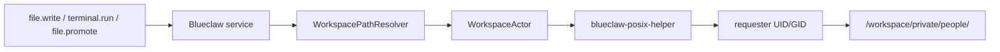
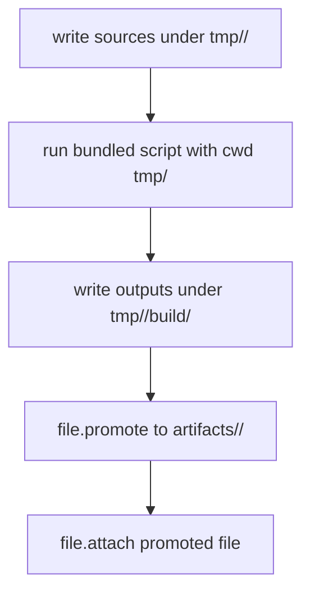

# Blueclaw

Blueclaw is the daemon that runs inside `InternKim`, a dedicated hardware appliance for company AI automation.

## Current Working Model

- `InternKim` is a separate computer that the customer owns
- `InternKim` is a headless device with no attached display
- `Blueclaw` runs on `InternKim` as a long-lived daemon
- `InternKim` is reachable remotely through `Cloudflare Tunnel`
- remote admin access is expected to sit behind `Cloudflare Tunnel` with `Google OAuth`
- `InternKim` connector sidecars own Mattermost, Slack, and Signal platform credentials
- `Blueclaw` receives normalized connector events from `InternKim` and never stores platform tokens
- `Mattermost` is self-hosted inside `InternKim`
- `Mattermost` is the primary collaboration surface for users, tasks, replies, progress, and approvals
- `Mattermost` is an `InternKim`-native internal service, separate from the isolated `Blueclaw` guest
- `Mattermost` realtime WebSocket ingress runs outside Blueclaw behind the capability boundary
- Slack and Signal are optional external connectors that share the same connector runtime without becoming the product center
- `Blueclaw` stores policy, memory, task state, backups, and artifacts on persistent workspace storage
- `Blueclaw` supports one-time, interval, and cron-based scheduled task execution
- `Blueclaw` may ask the user's main computer to open a browser instance when a flow requires direct user login or approval
- `Blueclaw` is configured and operated from the user's main computer through `SSH` and `HTTP API`
- the primary deployment model is `Blueclaw inside a long-lived Firecracker guest with only workspace mounted from the host`
- the primary development lab uses `macOS host -> Tart ARM Linux VM -> Firecracker -> Blueclaw`

## Architecture Picture

```text
  Mattermost users / admin channel
          ^
          |
          v
  +-----------------------------------+
  | InternKim hardware                |
  |                                   |
  |  Cloudflare Tunnel                |
  |  headless host OS                 |
  |    - tiny supervisor              |
  |    - capability sidecars          |
  |    - workspace volume             |
  |    - self-hosted Mattermost       |
  |                                   |
  |  isolated guest                   |
  |    - blueclaw daemon              |
  |    - postgres                     |
  |    - admin API                    |
  |    - task inbox API               |
  |    - policy engine                |
  |    - memory engine                |
  +-----------------------------------+
          ^                     ^
          |                     |
          |                     |
          v                     v
  +-----------------------------------+
  | user's main computer              |
  |    - SSH client                   |
  |    - admin/task UI client         |
  |    - companion bridge             |
  |    - browser instance             |
  |    - user approval surface        |
  +-----------------------------------+

Optional external channels such as Slack and Signal terminate in InternKim sidecars and enter Blueclaw only as normalized connector events.
```

## Main Computer Bridge

- `InternKim` and the user's main computer need a trusted communication channel
- the main computer runs a small companion bridge
- the bridge can launch a browser window or tab on the main computer
- login-required flows stay user-mediated instead of trying to bypass authentication
- `Blueclaw` can pause a task, ask for login or approval, and resume after the bridge reports completion
- scheduled automation should create new task runs instead of bypassing the task engine

## Control Plane

- `InternKim` has no local screen, so configuration happens from the user's main computer
- the primary control paths are `SSH`, `HTTP API`, and browser-based surfaces rendered on the main computer
- `Blueclaw` admin and task surfaces should be reachable through `SSH` port forwarding, authenticated API access, or a tightly scoped remote tunnel path
- the tunnel-protected admin surface should only admit the initial bootstrap administrator account or a `master admin` account
- `Google OAuth` is the outer remote access gate, and Blueclaw role checks are the inner authorization gate
- the physical appliance is the system of record, while the main computer is the operator console

## Messaging Plane

- `InternKim` owns Mattermost WebSocket ingress, Mattermost API calls, optional Slack Events API or Socket Mode, optional Signal sessions, platform tokens, and platform API calls
- `Blueclaw` exposes `/connectors/{platform}/events` as a normalized internal ingress endpoint for `InternKim` sidecars
- `Mattermost` events are the primary production connector path and enter Blueclaw through `ConnectorRuntime`
- `Slack` and `Signal` events use the same connector runtime as optional adapters
- Blueclaw keeps idempotency, invited-email authorization, task creation, progress orchestration, LLM reply decisions, and structured logs
- `Mattermost` is self-hosted inside `InternKim`
- `Mattermost` is an internal service separate from the isolated `Blueclaw` guest
- `InternKim` capability endpoints perform identity lookup, optional progress publication, reply send, and history fetch
- Mattermost typing/progress, Slack typing, and similar platform affordances are represented as optional InternKim progress, not as Blueclaw platform API calls
- InternKim sidecars suppress bot/self messages before forwarding events
- duplicate suppression, invited-email authorization, task creation, LLM reply generation, fallback replies, and structured logs remain shared by the connector core
- the messaging plane and the control plane should stay separated

## Connector Configuration

Runtime connector configuration is secretless. Blueclaw does not read Mattermost, Slack, or Signal tokens. Mattermost is enabled by default in InternKim deployments; Slack and Signal are optional adapters.

```json
{
  "capabilities": {
    "endpoint": "http://127.0.0.1:7781",
    "unixSocketPath": "/run/internkim/capability.sock",
    "timeoutSecond": 15
  },
  "connectors": {
    "mattermost": {},
    "slack": {
      "enabled": false
    },
    "signal": {
      "enabled": false
    }
  }
}
```

- `/connectors/mattermost/events` accepts the primary normalized event stream from the self-hosted Mattermost sidecar
- `/connectors/slack/events` and `/connectors/signal/events` accept optional external normalized events when those adapters are configured
- platform request signatures, bot tokens, WebSocket credentials, Signal session secrets, and platform reply credentials stay in InternKim sidecars
- Blueclaw capability adapters call `POST /v1/platform/{platform}/identity.resolve`, `reply.send`, and `history.fetch`; `progress.start` and `progress.stop` are optional
- inbound bodies use opaque `conversationID`, `messageID`, `senderID`, `replyTargetID`, `prompt`, and recent `context.messages`
- connector logs use `connector.<platform>.<stage>` event names
- persistent logs default to `/workspace/.blueclaw/logs` and are retained for 7 days unless configured otherwise

## Workspace, Tools, and Actor Boundary

Blueclaw separates orchestration identity from workspace side-effect identity.

- The Blueclaw daemon runs as the guest `blueclaw` user.
- The daemon resolves virtual paths, checks policy, validates tool schemas, records events, and asks the LLM for recovery or user-facing wording.
- Requester-visible filesystem and process side effects run through `WorkspaceActorFactory -> WorkspaceActor`.
- The production actor uses `blueclaw-posix-helper`, not direct `os.ReadFile`, `os.WriteFile`, `os.OpenFile`, or service-user process execution.
- The helper is installed as `root:root 4755`, authorizes only real UID root or `blueclaw`, then switches to the requester UID/GID/supplementary groups before touching the workspace.
- The helper does not own workspace path policy. Blueclaw owns path resolution and authorization; Linux POSIX owns final read/write/execute enforcement after identity transition.



Supported model-facing workspace path prefixes are virtual:

| Prefix | Meaning |
|---|---|
| `tmp/<slug>/...` | requester-private draft workspace for the current task |
| `artifacts/<slug>/...` | requester-private durable artifact location |
| `/workspace/circles/<circleID>/...` | durable circle location when policy allows access |
| `/workspace/shared/public/...` | explicitly public shared location |
| `/workspace/skills/...` | built-in skill source, read/execute only |

Disallowed model-facing paths include `/workspace/.blueclaw`, `/tmp`, `~`, `/opt`, `/usr`, another person's private path, and ambiguous relative `tmp` or `artifacts` from an unknown cwd.

Artifact work follows the same flow for document, spreadsheet, slide, and PDF skills:



Required artifact tasks are not complete until `file.attach` evidence points to promoted durable artifacts. A draft file under `tmp/<slug>`, a local path string, or a markdown link is not completion evidence.

Runtime failure recovery receives compact execution state plus the latest observation tail. Tool failures should surface concrete actor/path/stage details instead of generic "system limitation" text. If all LLM reply generation paths fail, Blueclaw records admin diagnostics and suppresses the outbound reply rather than using a deterministic canned sentence.

Minimal normalized event body:

```json
{
  "conversationID": "opaque-conversation-id",
  "messageID": "opaque-message-id",
  "senderID": "opaque-sender-id",
  "replyTargetID": "opaque-reply-target-id",
  "prompt": "current user message",
  "context": {
    "messages": [
      {
        "speaker": "admin",
        "text": "previous visible message"
      }
    ],
    "hasMoreBefore": true,
    "historyCursor": "opaque-history-cursor"
  }
}
```

## Language Model Configuration

Blueclaw uses a single secretless LLM provider named `capabilityLLM`. OpenRouter keys, LiteRT-LM model runtime, local GPU selection, and provider fallback policy are owned by InternKim capability services.

```json
{
  "capabilities": {
    "endpoint": "http://127.0.0.1:7781",
    "unixSocketPath": "/run/internkim/capability.sock",
    "timeoutSecond": 15
  },
  "languageModel": {
    "defaultProvider": "capabilityLLM",
    "capability": {
      "executionMode": "auto"
    }
  }
}
```

- Blueclaw sends `executionMode`, `messages`, and `structuredOutputSchema` to `POST /v1/llm/structured`; `model` is an optional override, not a default runtime requirement
- Blueclaw never adds an `Authorization` header for LLM capability calls
- `executionMode` is `local`, `remote`, or `auto`; InternKim decides whether that maps to OpenRouter, LiteRT-LM, Jetson GPU, or another provider
- `tools/blueclaw-litert-wrapper` is kept as an InternKim-side reference utility, not as a Blueclaw product runtime dependency
- user-facing replies, approval wording, recovery direction, and failure reports are generated through the LLM path
- if remote and local LLM paths are both unavailable, Blueclaw records admin-only diagnostics and suppresses outbound user replies instead of sending a fixed fallback sentence

## Virtual Session E2E

Fast virtual session tests are included in the normal Go suite:

```bash
go test ./...
```

Live virtual session tests call a real LLM provider and may spend money. They are never enabled by endpoint configuration alone. Run them only when explicitly requested:

```bash
BLUECLAW_E2E_LIVE=1 \
BLUECLAW_E2E_LLM_UNIX_SOCKET=/run/internkim/capability.sock \
go test ./internal/e2e -run TestSlidesLocalMultiturnSuccessLive -count=1
```

For inspectable artifacts, use the lab runner with the same explicit live flag:

```bash
go run ./cmd/blueclaw-lab virtual-session \
  --live-llm \
  --scenario slides \
  --artifact-dir .artifacts/blueclaw-e2e \
  --llm-unix-socket /run/internkim/capability.sock
```

## Graphiti Memory

Blueclaw uses Graphiti as the product memory engine through the `graphiti-memoryd` sidecar. Blueclaw owns identity, policy, ACL namespace selection, and prompt assembly; Graphiti owns episode ingestion, temporal graph extraction, Kuzu persistence, and hybrid graph search.

- `graphiti-memoryd` runs from `tools/graphiti-memoryd` with `graphiti-core[kuzu]`
- Kuzu data defaults to `/workspace/.blueclaw/graphiti/kuzu`
- accepted connector events are conservatively routed before Graphiti ingestion, skipping transient chatter and control messages
- workspace/business knowledge is additionally routed into `workspace:*` namespaces by `GraphitiIngestionRouter`
- Postgres stores only Graphiti namespace, episode mirror, and diagnostic metadata, not canonical memory records
- Graphiti LLM, embedding, and rerank calls use InternKim capability endpoints and receive no provider secrets

## Slack Migration Path

- new InternKim deployments start from self-hosted `Mattermost` as the primary collaboration space
- teams already using `Slack` may optionally migrate eligible workspace data into local `Mattermost`
- the target migration experience is `export from Slack -> transform -> import into local Mattermost -> continue with Blueclaw on top`
- `Blueclaw` can orchestrate and monitor this migration flow, but it must not assume it can bypass Slack export permissions or plan limits
- ongoing Slack connector support remains useful for transition periods and external team interoperability, not as the default product surface

## Security Boundary

- the preferred model is `Blueclaw entire runtime inside one isolated guest`
- the primary isolation boundary is the long-lived `Firecracker` guest
- the host exposes only one writable shared path, `workspace`
- the guest root filesystem stays immutable
- persistent application data lives under `workspace/.blueclaw`
- tools executed by `Blueclaw` run directly inside the guest boundary
- the user main computer is not the primary execution environment for agent work
- the user main computer is mainly for browser handoff, approval, and interactive login
- remote access should expose as little privileged surface as possible, even when `Cloudflare Tunnel` is enabled
- tunnel reachability alone is not sufficient for admin access
- admin actions should require both successful `Google OAuth` and membership in the allowed administrator account set

## Why This Model Fits

- it matches the product shape of a dedicated appliance
- it keeps long-lived secrets and memory on `InternKim`
- it allows local `Mattermost` hosting without depending on a third-party team chat host
- it allows the user to complete real web logins on their own machine
- it gives a clean trust boundary between host, guest, workspace, and desktop bridge
- it uses `Firecracker` as the primary guest runtime when the target hardware supports it

## Open Decisions

- how the main computer bridge authenticates to `InternKim`
- whether browser handoff uses a local bridge app, a local web UI, or both
- whether `Jetson Orin Nano Super` has a reliable enough `KVM` path for the primary guest runtime

## Status

- this README captures the current architecture picture
- it is intentionally a working design note, not a final product contract

## Development Lab

- the default development lane uses a single `M4 + macOS 15+` host
- the host acts as the main computer for companion, browser, and operator access
- `Tart` provides the ARM Linux virtual machine that simulates `InternKim`
- `Firecracker` runs inside that Linux virtual machine
- `Blueclaw` runs only inside the `Firecracker` guest
- `Mattermost` stays outside the guest and inside the Linux virtual machine
- `Docker` and `Apple container` are not part of this lab topology
