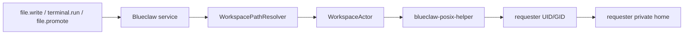
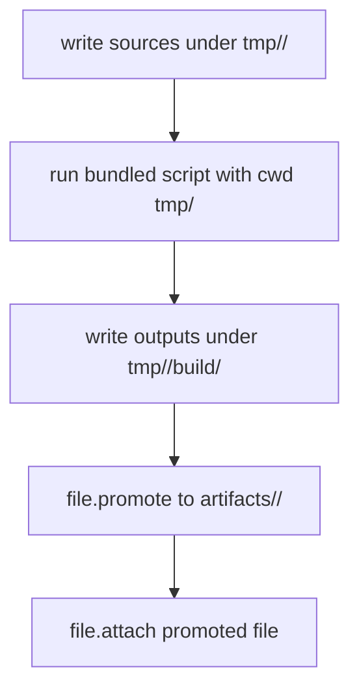

# Blueclaw Architecture

Blueclaw is the agent daemon of InternKim, an on-premise appliance for company
AI automation. This document describes the runtime as it is built today. The
appliance tooling that provisions and deploys Blueclaw lives in a separate
private repository; everything Blueclaw itself needs is in this one.

## Deployment Shape

- InternKim is a headless computer the customer owns, reachable through a Cloudflare Tunnel.
- Blueclaw runs inside a long-lived Firecracker guest with an immutable root filesystem.
- The host mounts exactly one writable path into the guest: `workspace`.
- Persistent application data lives under `workspace/.blueclaw`.
- Mattermost is self-hosted on the host beside the guest, not inside it.
- Blueclaw is configured and operated from the user's main computer over SSH and HTTP.

```text
  Mattermost users / admin channel
          ^
          |
          v
  +-----------------------------------+
  | InternKim hardware                |
  |                                   |
  |  Cloudflare Tunnel                |
  |  headless host OS                 |
  |    - tiny supervisor              |
  |    - capability sidecars          |
  |    - workspace volume             |
  |    - self-hosted Mattermost       |
  |                                   |
  |  isolated guest                   |
  |    - blueclaw daemon              |
  |    - postgres                     |
  |    - admin API                    |
  |    - task inbox API               |
  |    - policy engine                |
  |    - memory engine                |
  +-----------------------------------+
          ^                     ^
          |                     |
          v                     v
  +-----------------------------------+
  | user's main computer              |
  |    - SSH client                   |
  |    - admin/task UI client         |
  |    - companion bridge             |
  |    - browser instance             |
  |    - user approval surface        |
  +-----------------------------------+
```

The trust boundary is deliberate: long-lived secrets and memory stay on the
appliance, agent work executes inside the guest, and the user's own machine is
used only for browser handoff, approval, and interactive login.

## Control Plane

- The appliance has no local screen, so configuration happens from the operator's computer.
- Control paths are SSH, the HTTP API, and browser surfaces rendered on that computer.
- Google OAuth is the outer remote access gate; Blueclaw role checks are the inner authorization gate.
- Tunnel reachability alone never grants admin access.
- The physical appliance is the system of record; the main computer is the operator console.

## Messaging Plane

Blueclaw never holds platform credentials. InternKim sidecars own Mattermost
WebSocket ingress, Slack Events API or Socket Mode, Signal sessions, and every
platform token. They forward normalized events to
`POST /connectors/{platform}/events`.

- Mattermost is the primary production connector; Slack and Signal are optional adapters on the same connector runtime.
- Blueclaw owns idempotency, invited-email authorization, task creation, progress orchestration, reply decisions, and structured logs.
- Typing indicators and progress publication are optional capability calls, not Blueclaw platform API calls.
- Sidecars suppress bot and self messages before forwarding.
- Connector logs use `connector.<platform>.<stage>` event names.

Delivery is durable rather than fire-and-forget. Inbound events persist in
`raw_event` with a `pending`/`running`/`succeeded`/`failed` status, and replies
enqueue into `connector_outbox` referencing the originating event. Synthetic
resume sources — auto-resume after a runtime restart, ask-choice resolution,
steer — also create a backing `raw_event` row so the outbox foreign key holds.
Background workers claim stale rows with retry and backoff, duplicate inbound
events return the stored result instead of re-running, and the health check
fails on missing connector schema or excessive backlog.

Minimal normalized event body:

```json
{
  "conversationID": "opaque-conversation-id",
  "messageID": "opaque-message-id",
  "senderID": "opaque-sender-id",
  "replyTargetID": "opaque-reply-target-id",
  "prompt": "current user message",
  "context": {
    "messages": [{ "speaker": "admin", "text": "previous visible message" }],
    "hasMoreBefore": true,
    "historyCursor": "opaque-history-cursor"
  }
}
```

Runtime connector configuration is secretless:

```json
{
  "capabilities": {
    "transport": "vsock",
    "endpoint": "http://internkim-capability",
    "vsockCID": 2,
    "vsockPort": 7000,
    "timeoutSecond": 15
  },
  "connectors": {
    "mattermost": {}
  }
}
```

The runtime reaches the capability layer over vsock from inside the guest; a
Unix-socket transport is used only in non-guest development layouts. Slack and
Signal activate from the presence of their credential files on the host, not
from an `enabled` flag in Blueclaw config.

## Agent Task and Step Runtime

- **Task** is one user request lifecycle, from intake through the final reply or reaction.
- **Step** is one internal progress unit inside a Task. A Step either runs one tool with `continue`, or closes the Task with `finish`/`fail`.
- **Checkpoint** is optional user-visible progress text on a `continue` Step. It never closes the Task, and the tool still runs in the same Step.
- **Final Step** runs no tool and must send the reply, failure reply, or reaction that closes the Task.

Every `continue` action carries a `nextStepPlan` with `objective`,
`expectedTools`, `doneCriteria`, `risk`, and `workingSetReason`. The next Step's
working set is built from core tools, selected skills, outcome requirements,
recovery packets, and the previous plan's `expectedTools`. Extension tool
schemas exposed to the model stay capped
(`maxExtensionCallableToolCount` in `internal/agent/tool_exposure.go`); kernel
tools are always included on top of that cap. The runtime uses deterministic
working sets when candidates fit and calls the compact tool selector only when
the stage is ambiguous or exceeds the cap.

Completion and recovery gates are independent from tool visibility. Draft or
setup evidence such as site creation cannot finish a publish Task without the
required build, review, publish, and final status evidence.

## Workspace, Tools, and the Actor Boundary

Blueclaw separates orchestration identity from workspace side-effect identity.

- The daemon runs as the guest `blueclaw` user. It resolves paths, checks policy, validates tool schemas, records events, and asks the model for recovery or user-facing wording.
- Requester-visible filesystem and process side effects run through `WorkspaceActorFactory -> WorkspaceActor`.
- The production actor uses `blueclaw-posix-helper` rather than direct file or process calls as the service user.
- The helper is installed `root:root 4755`, authorizes only real UID root or `blueclaw`, then switches to the requester's UID, GID, and supplementary groups before touching the workspace.
- The helper owns no path policy. Blueclaw resolves and authorizes; Linux POSIX permissions are the final enforcement after the identity transition.



Model-facing workspace paths are virtual:

| Prefix | Meaning |
|---|---|
| `home/<path>/...` | requester-private durable source workspace |
| `tmp/<slug>/...` | requester-private draft workspace for the current task |
| `artifacts/<slug>/...` | requester-private durable artifact location |
| `/workspace/circles/<circleID>/...` | durable circle location when policy allows access |
| `/workspace/shared/public/...` | explicitly public shared location |
| `/workspace/skills/...` | built-in skill source, read and execute only |

The terminal command guardrail blocks paths that escape the workspace root while
allowing the standard safe device streams (`/dev/null`, `/dev/zero`,
`/dev/full`, `/dev/random`, `/dev/urandom`, `/dev/stdin`, `/dev/stdout`,
`/dev/stderr`, `/dev/tty`) so ordinary shell redirection works. Block devices
and other system `/dev` paths stay blocked.

Artifact work — documents, spreadsheets, slides, PDFs — follows one flow:



A task with required artifacts is not complete until `file.attach` evidence
points to a promoted durable artifact. A draft under `tmp/<slug>`, a local path
string, or a markdown link is not completion evidence. Contract verification
runs only when the task has explicit outcome requirements; empty contracts stay
on the fast path.

## Language Model Configuration

Blueclaw uses a single secretless provider named `capabilityLLM`. Provider keys,
local model runtimes, GPU selection, and fallback policy belong to the InternKim
capability services.

```json
{
  "languageModel": {
    "defaultProvider": "capabilityLLM",
    "capability": {
      "model": "google/gemini-3.1-flash-lite",
      "highModel": "google/gemini-3-flash-preview",
      "mediumModel": "",
      "lowModel": "",
      "executionMode": "auto",
      "contextWindowTokens": 1048576
    }
  }
}
```

- Blueclaw sends `model`, `executionMode`, `messages`, and `structuredOutputSchema` to `POST /v1/llm/structured`, and never adds an `Authorization` header.
- Requests route across three optional tiers by task complexity. Quick effort and simple tasks use the low tier, complex tasks use medium, deep or extended effort uses high; intake routing and failure wording always use low.
- `executionMode` is `device`, `companion`, `remote`, or `auto`. InternKim decides what that maps to.

The AI SDK runtime lives under `llmd/`. Selecting it requires a private Unix
socket and an installation auth key file. When `defaultProvider` is `llmd`,
structured output is authoritative and contract failures do not fall through to
`capabilityLLM`.

```json
{
  "languageModel": {
    "defaultProvider": "capabilityLLM",
    "llmd": {
      "unixSocketPath": "/run/blueclaw-llmd/llmd.sock",
      "authKeyPath": "/run/credentials/llmd-auth-key",
      "executionMode": "auto",
      "timeoutSecond": 60,
      "structuredSchemaNames": [
        "blueclaw_agent_turn_action",
        "blueclaw_agent_turn_finalizer",
        "blueclaw_turn_router",
        "blueclaw_recovery_decision",
        "blueclaw_operation_contract"
      ]
    }
  }
}
```

The direct socket configuration is for native development and tests. Appliance
packaging keeps provider credentials in a host service and proxies guest
requests through the capability boundary.

Every user-facing sentence — replies, approval wording, recovery direction,
failure reports — is generated through the model. Deterministic code validates,
normalizes, orchestrates retries, and records diagnostics, but does not compose
sentences for users. For a real task failure the reply path validates a draft
against two gates: only safety and fact checks (no secret or diagnostic leak, no
false delivery claim) can block a draft, while style and intent issues merely
trigger repair. Blueclaw tries generated wording, then repair, then local
wording, then delivers the best safety-passing draft, and only as a last resort
sends a compact redacted raw-error notice. Full suppression is reserved for
duplicates, cancellations, and self or bot messages.

## Memory

Blueclaw uses Graphiti as the product memory engine through the
`graphiti-memoryd` sidecar. Blueclaw owns identity, policy, ACL namespace
selection, and prompt assembly; Graphiti owns episode ingestion, temporal graph
extraction, Kuzu persistence, and hybrid graph search.

- The sidecar runs from `tools/graphiti-memoryd` with `graphiti-core[kuzu]`.
- Kuzu data defaults to `/workspace/.blueclaw/graphiti/kuzu`.
- Accepted connector events are conservatively routed before ingestion, skipping transient chatter and control messages.
- `GraphitiIngestionRouter` additionally routes workspace and business knowledge into `workspace:*` namespaces.
- Postgres stores only namespace, episode mirror, and diagnostic metadata, never canonical memory records.
- Graphiti's own model calls go through InternKim capability endpoints and receive no provider secrets.

## Protocol Contracts

Cross-process agent, LLM, capability, task, and connector contracts live under
`protocol/`. Zod schemas are the source for deterministic JSON Schema artifacts,
and shared fixtures verify that the Go wire DTOs retain their behavior.

```bash
cd protocol
bun install
bun run generate
bun run build
bun test
```

## Chat Adapters

`chatd/` is the TypeScript chat bridge. It normalizes platform events into the
connector body above and renders outbound replies per platform. Adapters live
under `chatd/src/adapters/`; the Mattermost adapter vendors an MIT-licensed
client whose license is kept alongside it.

Teams already on Slack can migrate eligible workspace data into the local
Mattermost — export, transform, import, then continue with Blueclaw on top.
Blueclaw can orchestrate and monitor that flow but never assumes it can bypass
Slack export permissions or plan limits.

## Development Lab

The default lane is a single Apple Silicon macOS host acting as the main
computer, with Apple `container` providing an ARM Ubuntu VM that stands in for
the appliance, Firecracker inside that VM, and Blueclaw inside the Firecracker
guest. Mattermost stays in the VM, outside the guest. Docker is not part of this
topology.

`lab/scripts/` holds the provisioning and scenario scripts this lane runs. They
are driven by the private appliance repository's `internkim dev` commands and
are included here so the guest-side contract is readable.
