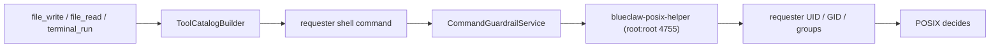
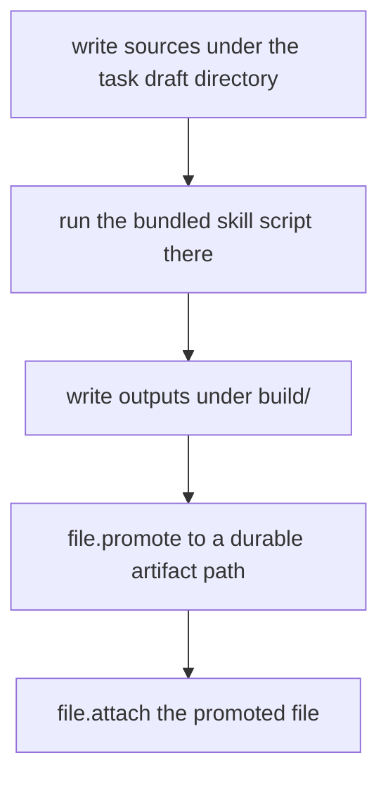

# Blueclaw Architecture

Blueclaw is the agent daemon of InternKim, an on-premise appliance for company
AI automation. This document describes the runtime as it is built today. The
appliance tooling that provisions and deploys Blueclaw lives in a separate
private repository; everything Blueclaw itself needs is in this one.

## Deployment Shape

- InternKim is a headless computer the customer owns, reachable through a Cloudflare Tunnel.
- Blueclaw runs inside a long-lived Firecracker guest with an immutable root filesystem.
- The host mounts exactly one writable path into the guest: `workspace`.
- Persistent application data lives under `workspace/.blueclaw`.
- Mattermost is self-hosted on the host beside the guest, not inside it.
- Blueclaw is configured and operated from the user's main computer over SSH and HTTP.

```text
  Mattermost users / admin channel
          ^
          |
          v
  +-----------------------------------+
  | InternKim hardware                |
  |                                   |
  |  Cloudflare Tunnel                |
  |  headless host OS                 |
  |    - tiny supervisor              |
  |    - capability sidecars          |
  |    - workspace volume             |
  |    - self-hosted Mattermost       |
  |                                   |
  |  isolated guest                   |
  |    - blueclaw daemon              |
  |    - postgres                     |
  |    - admin API                    |
  |    - task inbox API               |
  |    - policy engine                |
  |    - memory engine                |
  +-----------------------------------+
          ^                     ^
          |                     |
          v                     v
  +-----------------------------------+
  | user's main computer              |
  |    - SSH client                   |
  |    - admin/task UI client         |
  |    - companion bridge             |
  |    - browser instance             |
  |    - user approval surface        |
  +-----------------------------------+
```

The trust boundary is deliberate: long-lived secrets and memory stay on the
appliance, agent work executes inside the guest, and the user's own machine is
used only for browser handoff, approval, and interactive login.

## Control Plane

- The appliance has no local screen, so configuration happens from the operator's computer.
- Control paths are SSH, the HTTP API, and browser surfaces rendered on that computer.
- Google OAuth is the outer remote access gate; Blueclaw role checks are the inner authorization gate.
- Tunnel reachability alone never grants admin access.
- The physical appliance is the system of record; the main computer is the operator console.

## Messaging Plane

Blueclaw never holds platform credentials. Sidecars own Mattermost WebSocket
ingress, Slack Events API or Socket Mode, and Signal sessions, along with every
platform token. They forward normalized events to
`POST /connectors/{platform}/events`.

Four ingress adapters are wired today:

| Platform | Purpose |
|---|---|
| `mattermost` | Primary production collaboration surface |
| `slack` | Optional external adapter on the same connector runtime |
| `signal` | Optional external adapter, off by default |
| `api` | Direct programmatic task submission, addressed by requester email |

Outbound delivery either calls the capability layer directly or routes through
`chatd`, the TypeScript chat bridge, per platform:

```json
"connectors": {
  "mattermost": {},
  "slack": {},
  "signal": { "enabled": false },
  "chatd": { "endpoint": "http://127.0.0.1:18090", "enabledPlatforms": [] }
}
```

Blueclaw owns idempotency, invited-email authorization, task creation, progress
orchestration, reply decisions, and structured logs. Typing indicators and
progress publication are optional capability calls, not Blueclaw platform API
calls. Sidecars suppress bot and self messages before forwarding. Connector logs
use `connector.<platform>.<stage>` event names.

Delivery is durable rather than fire-and-forget. Inbound events persist in
`raw_event` with a `pending`/`running`/`succeeded`/`failed` status, and replies
enqueue into `connector_outbox` referencing the originating event. Synthetic
resume sources — auto-resume after a runtime restart, ask-choice resolution,
steer — also create a backing `raw_event` row so the outbox foreign key holds.
Background workers claim stale rows with retry and backoff, duplicate inbound
events return the stored result instead of re-running, and the health check
fails on missing connector schema or excessive backlog.

Minimal normalized event body:

```json
{
  "conversationID": "opaque-conversation-id",
  "messageID": "opaque-message-id",
  "senderID": "opaque-sender-id",
  "replyTargetID": "opaque-reply-target-id",
  "prompt": "current user message",
  "context": {
    "messages": [{ "speaker": "admin", "text": "previous visible message" }],
    "hasMoreBefore": true,
    "historyCursor": "opaque-history-cursor"
  }
}
```

Runtime configuration is secretless. The guest reaches the capability layer over
vsock; a Unix socket is used only in non-guest development layouts.

```json
"capabilities": {
  "transport": "vsock",
  "endpoint": "http://internkim-capability",
  "vsockCID": 2,
  "vsockPort": 7000,
  "timeoutSecond": 15
}
```

## Agent Task and Step Runtime

- **Task** is one user request lifecycle, from intake through the final reply or reaction.
- **Step** is one internal progress unit inside a Task. A Step either runs one tool with `continue`, or closes the Task with `finish`/`fail`.
- **Checkpoint** is optional user-visible progress text on a `continue` Step. It never closes the Task, and the tool still runs in the same Step.
- **Final Step** runs no tool and must send the reply, failure reply, or reaction that closes the Task.

The turn contract is a discriminated union of four actions, defined in
`protocol/src/agent.ts`:

| Action | Carries |
|---|---|
| `continue` | `toolName`, `toolInput` |
| `set_quality_criteria` | `qualityCriteria` |
| `finish` | `message`, `completionEvidenceIDs`, `qualityReview`, `goalStatus: satisfied` |
| `fail` | `reason`, `goalStatus: blocked`, optional `usedFailureFacts` |

Every action carries an `executionStateUpdate` — `workspace`, `knownFacts`,
`triedAndFailed`, `currentBlocker`, `nextPlan`, `wasCompacted`. This is the
model's own running notes, threaded forward across steps so a long task keeps
its bearings without re-reading the whole observation stream. It replaced an
earlier per-step plan object whose fields the model spent tokens filling and the
runtime mostly ignored.

Tool exposure is separate from all of this. Extension tool schemas offered to the
model are capped at `maxExtensionCallableToolCount` (15, in
`internal/agent/tool_exposure.go`); kernel tools are always included on top of
that cap. The runtime uses deterministic working sets when candidates fit and
calls the compact tool selector only when the stage is ambiguous or exceeds the
cap.

Completion gates are independent from tool visibility. A `finish` must name the
observations that prove the work happened, and draft or setup evidence such as
site creation cannot close a publish Task without the required build, review,
publish, and final status evidence.

## Workspace, Tools, and the Actor Boundary

Blueclaw separates orchestration identity from workspace side-effect identity.

The daemon runs as the guest `blueclaw` user. It selects tools, validates
schemas, records events, and asks the model for recovery or user-facing wording.
Anything a requester can observe as a side effect — files, processes — runs as
that requester instead.



File tools are not a separate code path from the terminal. `file_read`,
`file_write`, `file_edit`, and the rest build a shell command and run it through
the same requester-identity primitive, so tilde expansion, globs, and relative
paths carry native POSIX semantics rather than a hand-written path vocabulary.
Quoting arguments is serialization; mapping exit codes and stderr to failure
kinds is diagnostics. Neither is an access decision.

The access decision belongs to the kernel:

- The helper is installed `root:root 4755`, authorizes only real UID root or `blueclaw`, then switches to the requester's UID, GID, and supplementary groups.
- People project to `bc_person_<shortID>` users, circles to `bc_circle_<circleID>` groups, shared access to `bc_shared`, and service internals to `blueclaw`.
- `/workspace/.blueclaw/*` is service-owned and unreadable by task users. Directory ownership and mode bits under `/workspace/private/people/<personID>`, `/workspace/circles/<circleID>`, and `/workspace/shared/*` are the final boundary.

There is no executable allowlist, no denied-command list, and no denied-path
prefix list. `TerminalConfiguration` carries only mode, sandbox provider,
workspace root, helper path, timeout, output cap, session cap, and the network
and interactive-shell switches. A command an actor may not run simply fails at
execution. What `CommandGuardrailService` still enforces is narrow and
structural: it refuses to run as root at all, resolves the working directory
against the workspace root, sanitizes the environment, caps the timeout, and in
sandbox mode requires bubblewrap.

Artifact work — documents, spreadsheets, slides, PDFs — follows one flow:



A task with required artifacts is not complete until `file.attach` evidence
points at a promoted durable file. A draft path, a local path string, or a
markdown link is not completion evidence. Contract verification runs only when
the task has explicit outcome requirements; empty contracts stay on the fast
path.

## Language Model Configuration

Model access reaches Blueclaw through `llmd`, the AI SDK sidecar, over a private
Unix socket. Provider keys live there rather than in the daemon, so Blueclaw
never adds an `Authorization` header of its own; it sends `model`,
`executionMode`, `messages`, and `structuredOutputSchema` to
`POST /v1/llm/structured` or `POST /v1/llm/chat`.

A deployment may also declare a secretless provider named `capabilityLLM`, which
hands model choice, local runtimes, GPU selection, and fallback policy to a
capability service — that is how the InternKim appliance runs. It is optional:
with no capability endpoint configured, Blueclaw uses `llmd` alone and reports
`capabilityd: not_configured` in its health document.

`executionMode` is `device`, `companion`, `remote`, or `auto`; InternKim decides
what that maps to. A tool that needs the user's own browser or files resolves to
`companion` regardless of the rest.

Requests route across six named tiers — `xlowModel`, `lowModel`, `mediumModel`,
`highModel`, `xhighModel`, and a separate `codingModel` — with
`maximumModelTier` and `minimumModelTier` bounding where the runtime may ladder.
Cheap classification (addressing, intake routing) sits at the bottom, ordinary
work in the middle, deep or extended effort at the top; failure and recovery
wording deliberately stays cheap. On a tier failure the runtime ladders within
the configured ceiling rather than pinning one model, so configuration names
tiers, never a single model.

The AI SDK runtime lives under `llmd/`, reached over a private Unix socket with
an installation auth key file. When `defaultProvider` is `llmd`, structured
output is authoritative and contract failures do not fall through to
`capabilityLLM`. `structuredSchemaNames` selects which schemas take that path;
the default set is in `internal/llm/provider_factory.go`:

```json
"llmd": {
  "unixSocketPath": "/run/blueclaw-llmd/llmd.sock",
  "authKeyPath": "/run/credentials/llmd-auth-key",
  "executionMode": "auto",
  "timeoutSecond": 60,
  "structuredSchemaNames": [
    "blueclaw_agent_turn_action",
    "blueclaw_agent_turn_finalizer",
    "blueclaw_turn_router",
    "blueclaw_recovery_decision",
    "blueclaw_contract_skill_arbitration",
    "blueclaw_completion_judge"
  ]
}
```

Those six are the routing hot path; the runtime defines roughly thirty named
schemas in total, one per structured decision. The direct socket configuration
is for native development and tests — appliance packaging keeps provider
credentials in a host service and proxies guest requests through the capability
boundary.

Tool input schemas stay shallow and provider-portable: string-only enums, no
`const`, no `$ref`, no exotic formats. Enumerated numeric values go in the
description and the runtime validates the actual value deterministically, because
some providers drop properties with numeric enums and then reject the orphaned
`required` entry.

Every user-facing sentence — replies, approval wording, recovery direction,
failure reports — is generated through the model. Deterministic code validates,
normalizes, orchestrates retries, and records diagnostics, but does not compose
sentences for users. For a real task failure the reply path validates a draft
against two gates: only safety and fact checks (no secret or diagnostic leak, no
false delivery claim) can block a draft, while style and intent issues merely
trigger repair. Blueclaw tries generated wording, then repair, then local
wording, then delivers the best safety-passing draft, and only as a last resort
sends a compact redacted raw-error notice. Full suppression is reserved for
duplicates, cancellations, and self or bot messages.

## Memory

Memory has two layers.

The durable layer is a markdown store (`internal/memory/markdown_store.go`) with
its own compaction pass, mirrored in Postgres as `memory_record` and
`memory_source`. Blueclaw owns identity, policy, and ACL namespace selection for
every read and write.

Optional on top of that is a temporal knowledge graph through the
`graphiti-memoryd` sidecar, which owns episode ingestion, graph extraction, Kuzu
persistence, and hybrid search. It is configured by `memory.graphitiEndpoint`
and the runtime stays fully functional when that endpoint is unset — the graph
is an enrichment, not a dependency.

- The sidecar runs from `tools/graphiti-memoryd` with `graphiti-core[kuzu]`.
- Kuzu data defaults to `/workspace/.blueclaw/graphiti/kuzu`.
- Accepted connector events are conservatively routed before ingestion, skipping transient chatter and control messages.
- Postgres stores only namespace, episode mirror, and diagnostic metadata (`graphiti_namespace`, `graphiti_episode`), never canonical memory records.
- Graphiti's own model calls go through InternKim capability endpoints and receive no provider secrets.

## Protocol Contracts

Cross-process agent, LLM, capability, task, and connector contracts live under
`protocol/`. Zod schemas are the source for deterministic JSON Schema artifacts,
and shared fixtures verify that the Go wire DTOs retain their behavior.

```bash
cd protocol
bun install
bun run generate
bun run build
bun test
```

A value list consumed by more than one language is defined once and derived
everywhere else. Where a consumer cannot import the definition, a conformance
test reads the canonical source and fails on drift — `chatd/tests/buzz-adapter.test.ts`
reads `internal/agent/reaction_emoji.go` this way.

## Chat Adapters

`chatd/` normalizes platform events into the connector body above and renders
outbound replies per platform. Two adapters ship: `mattermost`, which vendors an
MIT-licensed client whose license is kept alongside it, and `buzz`, a
relay-based messenger with per-user identities rather than a single bot account.

Teams already on Slack can migrate eligible workspace data into the local
Mattermost — export, transform, import, then continue with Blueclaw on top.
Blueclaw can orchestrate and monitor that flow but never assumes it can bypass
Slack export permissions or plan limits.

## Development Lab

`cmd/blueclaw-lab` drives the rig this repository ships: an Apple Silicon macOS
host acting as the main computer, a Tart ARM Ubuntu virtual machine standing in
for the appliance, Firecracker inside that machine, and Blueclaw inside the
Firecracker guest. Mattermost stays in the virtual machine, outside the guest.
`config/lab.example.json` configures all three layers, and `lab/scripts/` holds
the provisioning and connector scenario scripts.

```bash
go run ./cmd/blueclaw-lab --configuration config/lab.example.json vm-up
go run ./cmd/blueclaw-lab --configuration config/lab.example.json smoke-firecracker
go run ./cmd/blueclaw-lab --configuration config/lab.example.json vm-down
```

The same binary runs `virtual-session`, which drives the agent loop without any
virtual machine at all. The private appliance repository has its own fleet lane
built on Apple `container`; it reuses `lab/scripts/` but none of the Tart setup
above.
